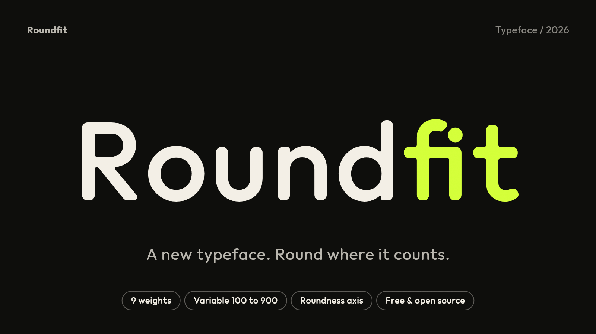
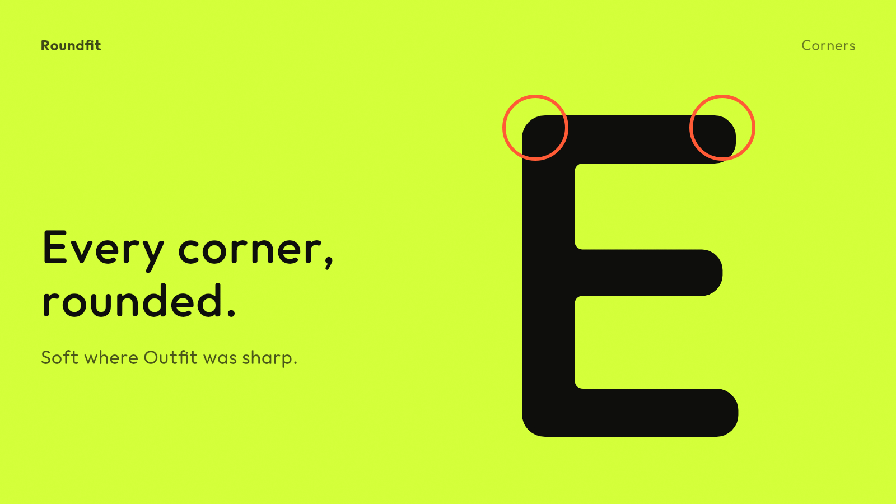
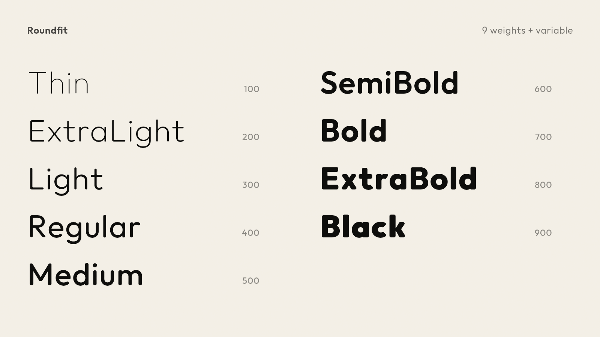
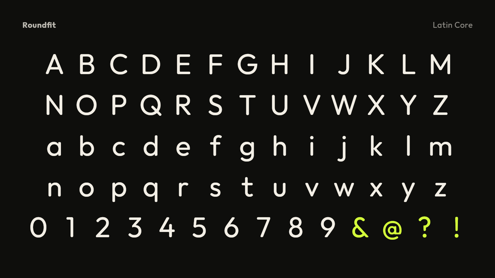
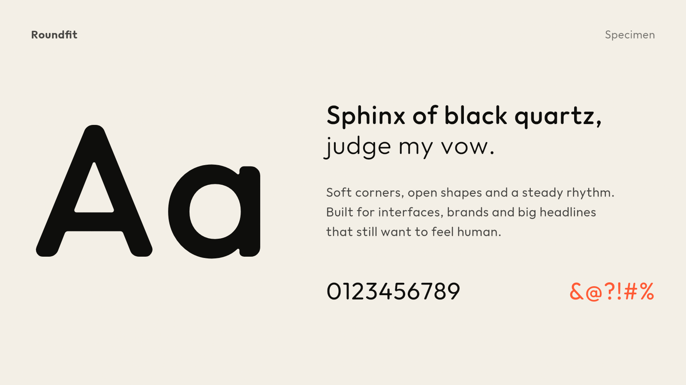
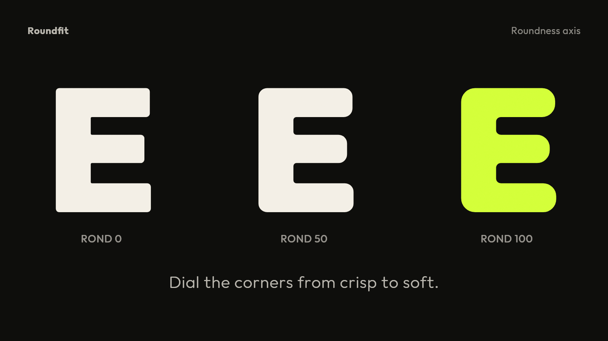

# Roundfit



A playful, rounded-corner typeface derived from
[Outfit](https://github.com/Outfitio/Outfit-Fonts).

Changes from Outfit: rounded corners (adjustable with the `ROND` axis, 0–100), looser kerning and tracking, and the
`outfit` ligatures removed.

## Preview

<p>
  
  
  
  
  
</p>

## Contents

- `fonts/` — TTF, OTF, variable and woff2 files
- `sources/` — Roundfit UFO masters + designspace (weight 100–900, roundness 0–100)
- `images/` — preview images
- `index.html` — type specimen (open in a browser)
- `OFL.txt` — license

## Build

```bash
pip install fontmake
fontmake -m sources/Roundfit.designspace -o variable --flatten-components
```

## License

Roundfit is licensed under the [SIL Open Font License 1.1](OFL.txt), the
same license as Outfit. Original design by Rodrigo Fuenzalida and The Outfit
Project Authors.

## Author

Roundfit by Sachithra Pushpawela.
